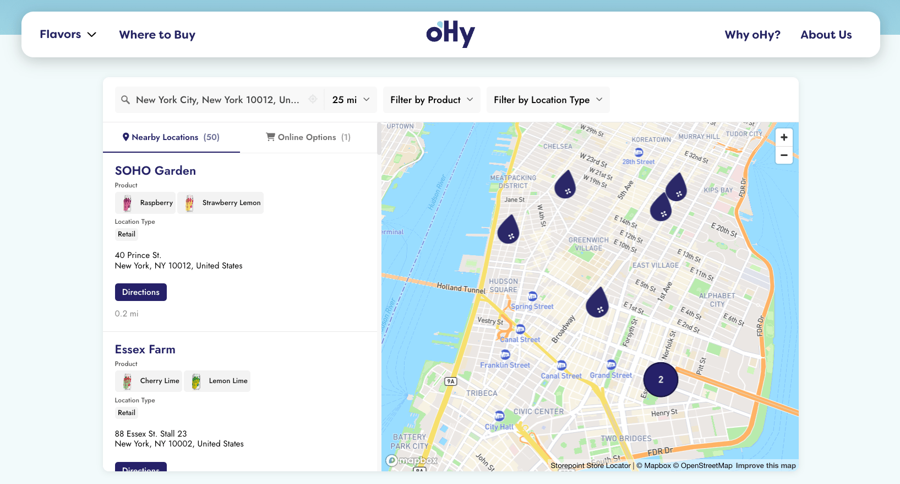
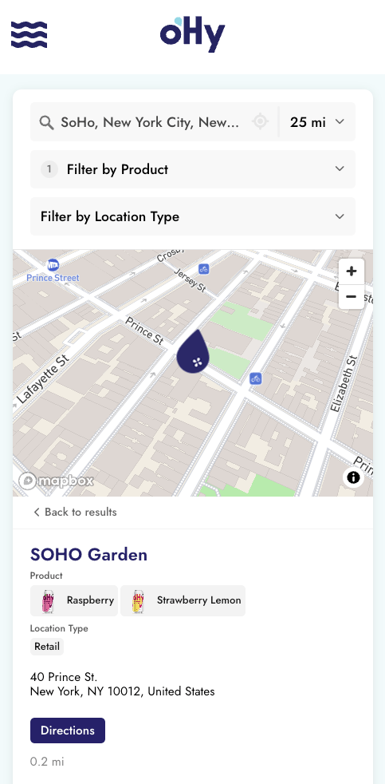

# Storepoint Locator Recipes

<p align="center">
  <a href="https://storepoint.co/examples">
    
  </a>
  <br />
  <a href="https://storepoint.co/examples">
    
  </a>
  <br />
  <sub><a href="https://storepoint.co/examples">See more live store locator examples on storepoint.co/examples</a></sub>
</p>

Code recipes for configuring and customizing the [Storepoint](https://storepoint.co) store locator widget through its embed snippet. Build a JavaScript store locator from a CSV file, JSON file, published Google Sheet, or the Storepoint API, with Mapbox or Google Maps, on Shopify, React, WordPress, Webflow, Squarespace, or any other website.

Most Storepoint customers manage their locator entirely from the [Storepoint dashboard](https://app.storepoint.co/login). These recipes are for developers who want code-level flexibility, custom filter UIs, platform-specific integrations like Shopify Theme Sections, or a working preview generated straight from code and local data while prototyping.

> **Not a developer?** You don't need this repo. The dashboard handles the full setup. Import a CSV (with automatic geocoding), configure filters, styling, and hours, and paste the generated embed into Shopify, Squarespace, Wix, WordPress, or any other website. See [live examples](https://storepoint.co/examples) or start a [free trial](https://app.storepoint.co/register).

## Custom code examples

| Recipe | What it does |
| --- | --- |
| [Quickstart](./examples/quickstart) | Minimum production embed |
| [Custom filter — date range](./examples/custom-filters/date-range) | Calendar-style date-range filter on a date custom field |

## Platform integrations

| Platform | What it does |
| --- | --- |
| [Shopify Theme Section](./platforms/shopify) | Liquid section with merchant-configurable schema settings, auto-localized per Shopify Market |
| [React component](./platforms/react) | `useStorepointWidget` hook for React apps |

For Webflow, Squarespace, Wix, WordPress, Drupal, Joomla, and other platforms, the standard [Quickstart embed](./examples/quickstart) works directly. See [platforms/README.md](./platforms/README.md) for details.

## Data sources

Configure the widget to load locations from a CSV file, JSON file, any URL that returns CSV or JSON, or inline rows. Works with any widget ID. Use your real public widget ID in production, or `'local'` for previewing without an account.

| Recipe | What it does |
| --- | --- |
| [Store locator from CSV](./examples/data-sources/store-locator-from-csv) | Store locator from a CSV file (recommended starting point) |
| [Store locator from JSON](./examples/data-sources/store-locator-from-json) | Same, but from a JSON URL or inline JSON array |
| [Product locator](./examples/data-sources/product-locator) | Where-to-buy pattern, single filter, product-by-location |
| [Service locator](./examples/data-sources/service-locator) | Multiple filter groups for service businesses with availability dates |

For the feature overview, see [docs/data-sources.md](./docs/data-sources.md).

## Map providers

Override the map provider in the embed instead of the dashboard.

| Recipe | What it does |
| --- | --- |
| [Mapbox](./examples/map-providers/mapbox) | Mapbox public token for the basemap and search suggestions |
| [Google Maps](./examples/map-providers/google-maps) | Google Maps browser API key for the basemap and search suggestions |

## Local testing mode

Use `'local'` as the widget ID to preview the locator without creating an account. Generates a working store locator from a CSV file, JSON file, published Google Sheet, or any URL that returns CSV in JavaScript, useful for mockups, demos, AI-generated previews, and prototyping before connecting Storepoint to your data. Pair it with any of the data source recipes above.

For details, see [docs/local-testing-mode.md](./docs/local-testing-mode.md).

## Common scenarios

| If you want to... | Start here |
| --- | --- |
| Build a JavaScript store locator widget from a CSV file | [store-locator-from-csv](./examples/data-sources/store-locator-from-csv) |
| Build a store locator from a JSON file or API endpoint | [store-locator-from-json](./examples/data-sources/store-locator-from-json) |
| Use a published Google Sheet as the data source | [store-locator-from-csv](./examples/data-sources/store-locator-from-csv) (point at the Sheet's published CSV URL) |
| Add a "Where to Buy" page driven by product → store data | [product-locator](./examples/data-sources/product-locator) |
| Build a service-provider directory with multiple filter groups | [service-locator](./examples/data-sources/service-locator) |
| Use Mapbox as the basemap and search provider | [Mapbox provider](./examples/map-providers/mapbox) |
| Use Google Maps as the basemap and Places search provider | [Google Maps provider](./examples/map-providers/google-maps) |
| Embed a locator on Shopify with merchant-configurable settings | [Shopify Theme Section](./platforms/shopify) |
| Embed a locator inside a React app | [React component](./platforms/react) |
| Embed a locator on Webflow, Squarespace, Wix, WordPress, or any other website | [Quickstart embed](./examples/quickstart) |
| Add a custom date-range filter on a date custom field | [date-range filter](./examples/custom-filters/date-range) |
| Preview a locator without a Storepoint account | Use `'local'` as the widget ID. See [local testing mode](./docs/local-testing-mode.md) |
| Move from a local preview to production | Swap `'local'` for your public widget ID. See [going-live.md](./docs/going-live.md) |

## Going to production

When the locator is working, replace `'local'` with your public Storepoint widget ID. The same widget keeps working, and you decide what stays in the embed and what moves to the [Storepoint dashboard](https://app.storepoint.co/dashboard).

```js
// Local testing
new StorepointWidget('local', '#storepoint-widget', { /* dataSource, fieldMap, settings, mapProvider */ });

// Production
new StorepointWidget('YOUR_PUBLIC_WIDGET_ID', '#storepoint-widget', { /* optional embed overrides */ });
```

In the dashboard you can import the same CSV (with automatic geocoding), edit locations from a spreadsheet-style UI, configure filter groups, manage hours and tags, and reuse the configuration across every embed without changing the HTML. Or keep the embed code authoritative. The widget supports both.

For the launch checklist and what to put in the embed vs the dashboard, see [docs/going-live.md](./docs/going-live.md).

## Sample data

The [`data/`](./data) folder contains three fictional datasets used by the recipes:

- [`sample-locations.csv`](./data/sample-locations.csv) / [`sample-locations.json`](./data/sample-locations.json): coffee chain
- [`product-flavors.csv`](./data/product-flavors.csv): ice-cream shops with flavors per location
- [`service-providers.csv`](./data/service-providers.csv): plumbers, electricians, HVAC contractors with services and availability dates

## Live store locator examples

See [real Storepoint store locators](https://storepoint.co/examples) running on customer websites. Each one is a hosted widget configured from the dashboard and embedded the same way these recipes embed.

## Resources

- [Storepoint home](https://storepoint.co)
- [Pricing](https://storepoint.co/pricing)
- [Storepoint dashboard](https://app.storepoint.co/dashboard)
- [Widget JavaScript API reference](https://storepoint.co/developers/widget-javascript-api)
- [Documentation](https://storepoint.co/docs)
- [Location Management API](https://storepoint.co/developers/location-management-api)
- [Location Query API](https://storepoint.co/developers/location-query-api)

## License

MIT-licensed example code. The Storepoint Locator Widget, dashboard, and brand are products of Storepoint and covered by the [Storepoint Terms of Service](https://storepoint.co/terms).
